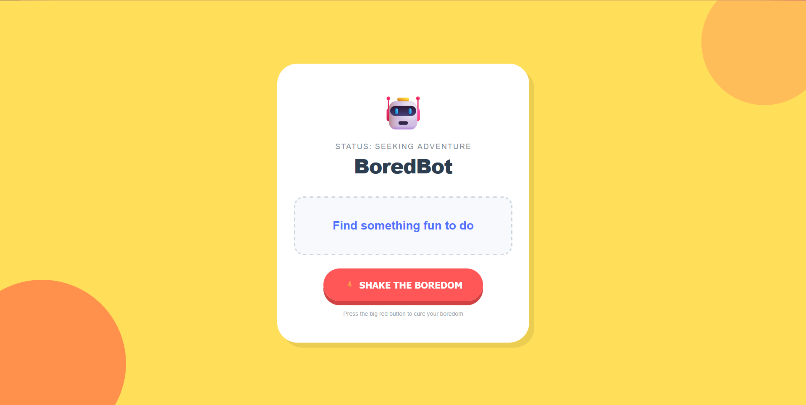

# BoreBOT 🤖

**BoreBOT** adalah aplikasi web sederhana yang dirancang untuk membantu pengguna mengatasi rasa bosan dengan memberikan saran aktivitas acak menggunakan Bored API.

---

## Live Demo

https://bore-bot-akf2.vercel.app/

## Screenshoot app



## ✨ Fitur Utama

- **Aktivitas Dinamis**: Mengambil ide kegiatan secara real-time dari API.
- **Status Bot**: Ikon dan teks status bot berubah sesuai dengan interaksi pengguna.
- **Visual Feedback**: Tombol menunjukkan status "Thinking" saat sedang memproses data.
- **Reset Function**: Fitur untuk membersihkan hasil dan memulai pencarian aktivitas baru.
- **Desain Responsif**: Tampilan yang ceria dengan elemen visual _blobs_ dan animasi tombol 3D.

---

## 🛠️ Tech Stack

| Teknologi      | Kegunaan                                           |
| -------------- | -------------------------------------------------- |
| **HTML5**      | Struktur konten dan aksesibilitas (ARIA labels)    |
| **CSS3**       | Layout Flexbox, variabel CSS, dan efek transisi 3D |
| **JavaScript** | Manipulasi DOM dan Fetch API untuk integrasi data  |
| **Bored API**  | Sumber data aktivitas (via Scrimba proxy)          |

---

## 📁 Struktur Proyek

```
BoreBOT/
├── index.html    # Struktur UI Utama
├── index.css     # Styling, variabel, dan animasi
└── main.js       # Logika pengambilan data dan interaksi DOM
```

---

## 🚀 Cara Menjalankan

1. Clone repository ini atau unduh filenya.
2. Buka file `index.html` di browser pilihan Anda.
3. Klik tombol **"⚡ SHAKE THE BOREDOM"** untuk mendapatkan aktivitas baru!

---

## 📝 Lisensi

Proyek ini dibuat untuk keperluan portofolio pribadi dan pembelajaran. Bebas digunakan sebagai referensi pengembangan aplikasi berbasis API.

---

**Dibuat oleh Rian**
